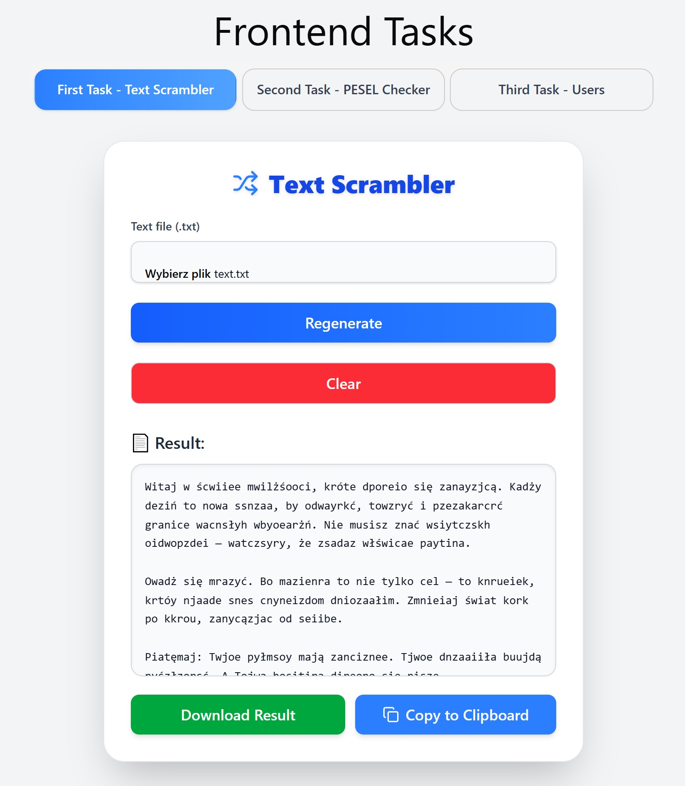
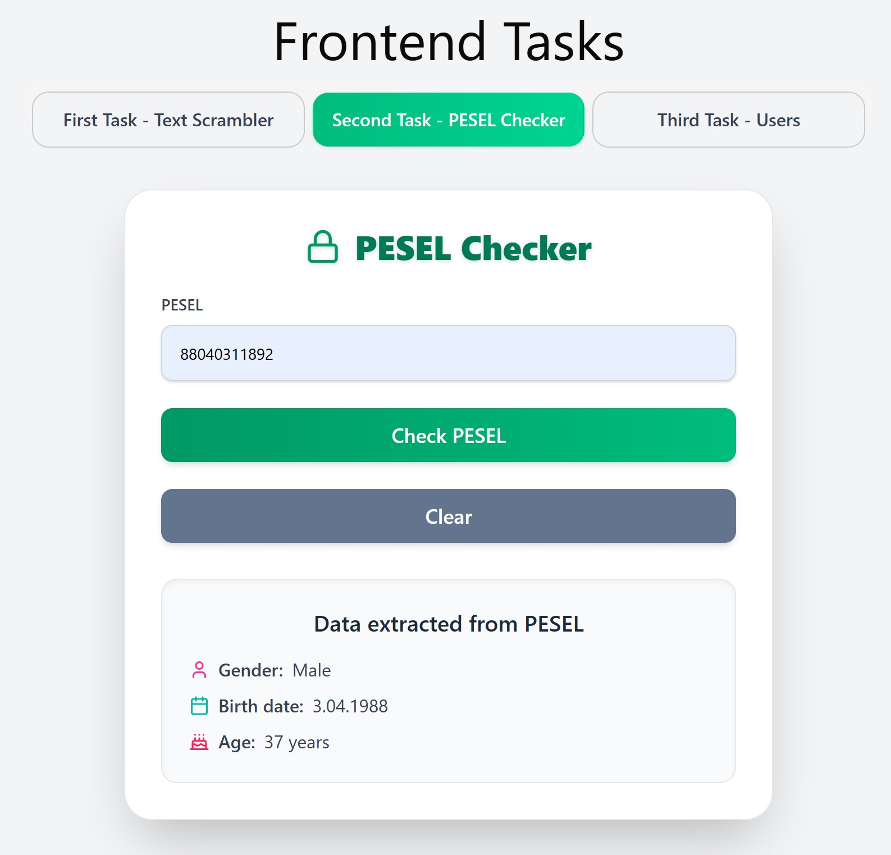
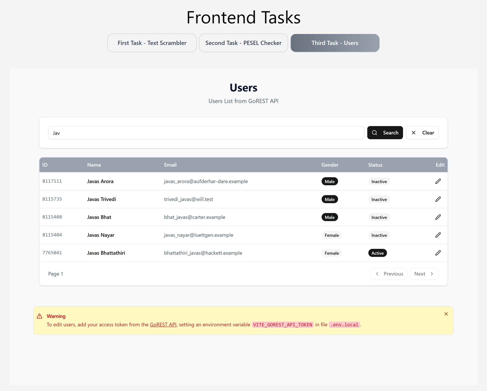
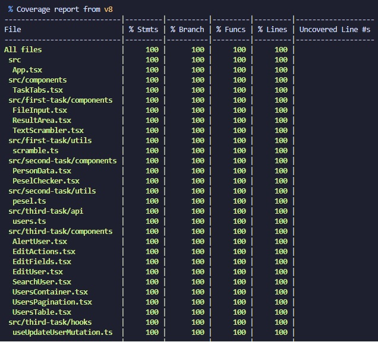

## Code for Task 1 is in [src/first-task](https://github.com/danielprzybytniewski/frontend-tasks/tree/main/src/first-task) folder.

## Code for Task 2 is in [src/second-task](https://github.com/danielprzybytniewski/frontend-tasks/tree/main/src/second-task) folder.

## Code for Task 3 is in [src/third-task](https://github.com/danielprzybytniewski/frontend-tasks/tree/main/src/third-task) folder.

## Screenshots









## Installation

```bash
$ git clone https://github.com/danielprzybytniewski/frontend-tasks.git
$ npm install
```

## 🔐 GoREST API Access Token Setup

To edit users in this project, you need to provide your personal access token from the [GoREST API](https://gorest.co.in/consumer/login).

### Steps

1. Create a `.env.local` file in the root of the project (if it doesn't exist).
2. Add the following line to the file:

   ```env
   VITE_GOREST_API_TOKEN=your_access_token_here
   ```

3. Replace `your_access_token_here` with your actual access token from GoREST.
4. Save the file and restart the development server to apply the changes.

## Running the app

```bash
# Development mode
$ npm run dev

# Production build
$ npm run build
$ npm run preview
```

```bash
# Run all tests
$ npm run test

# Watch mode for tests
$ npm run test:watch

# Test coverage report
$ npm run test:coverage
```
